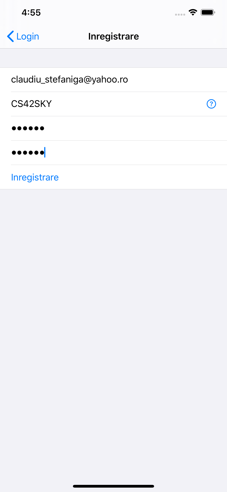
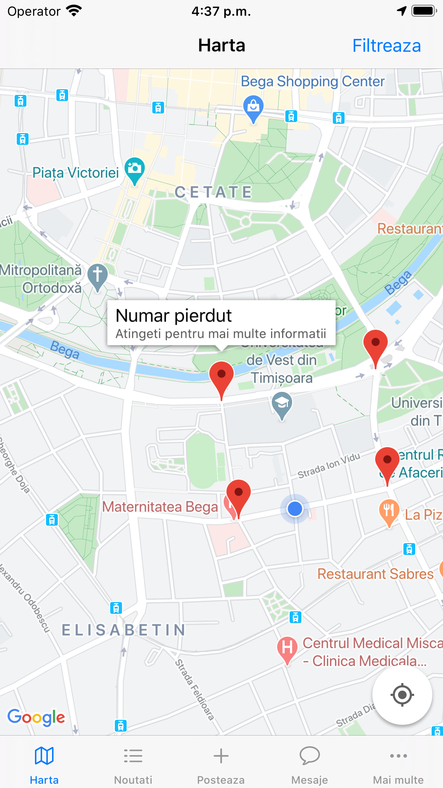
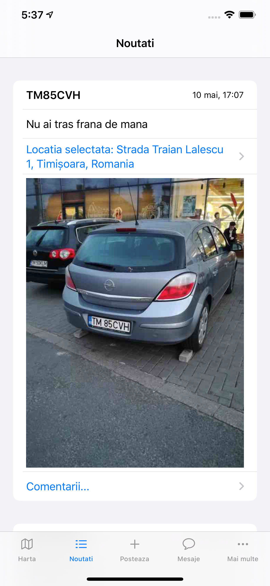
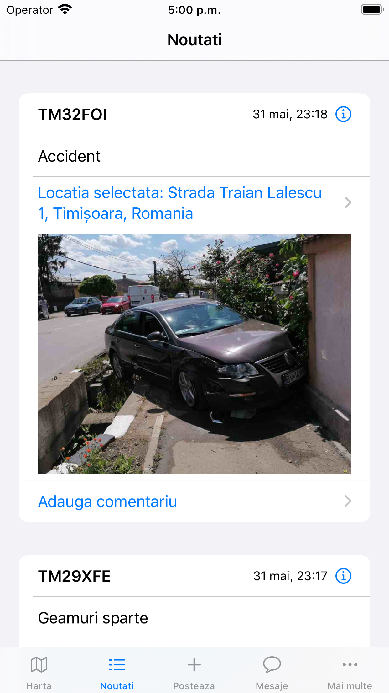
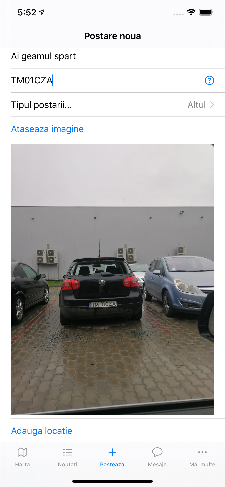
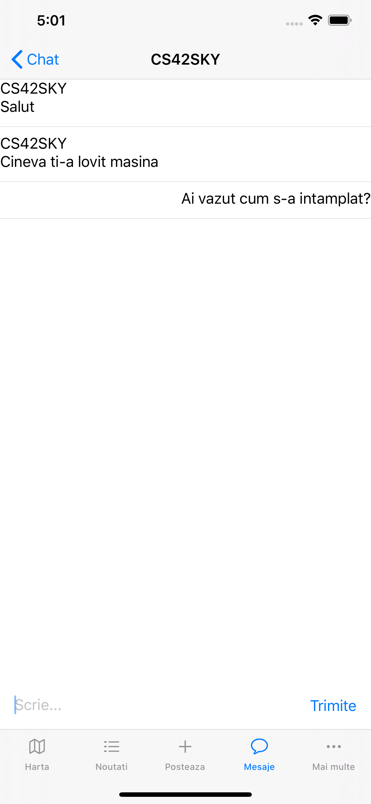

# Info Trafic

O aplicatie cu si despre participantii la trafic. Prin intermediul aplicatiei poti informa ceilalti participanti despre accidente, blocaje, tamponari sau orice pericol din trafic. Mai mult, comunica cu ei prin mesaje pe baza numarului de inmatriculare.

# Cum functioneaza?

Dupa ce ai descarcat aplicatia, trebuie sa te inregistrezi folosind o adresa de e-mail si un numar de inmatriculare. Pe baza numarului de inmatriculare contul tau va fi identificat si vei primi mesaje si notificari de la ceilalti participanti la trafic.

## Harta

Contine toate postarile despre incidentele din trafic sub forma de locatii. Prin apasarea unei locatii un pop-up se deschide si poti vedea toate detaliile despre acea postare.

## Noutati

Contine toate postarile sub forma detaliata. Poti vedea ora la care a avut loc incidentul, o descriere a acestuia si locatia sa. De asemenea poti adauga sau vedea comentariile celorlati utilizatori pentru o anumita postare.

## Posteaza

Ai vazut un accident/incident in trafic? Spune si celorlalti.
Adauga o scurta descriere, numarul de inmatriculare al masinii implicate in incident/accident(pentru a putea fi informat imediat despre ce s-a intamplat), o imagine si locatia.

## Mesaje

Vrei sa transmiti un mesaj unui participant din trafic? Nimic mai simplu. Cauta numarul lui de inmatriculare in Mesaje, iar daca acesta foloseste apicatia, poate incepe discutia.

### Contact

Pentru orice informatii, probleme, noi functionalitati ce v-ar placea sa fie adaugate ma puteti contacta la claudiu_stefaniga@yahoo.ro sau prin intermediul aplicatiei la CS42SKY.
