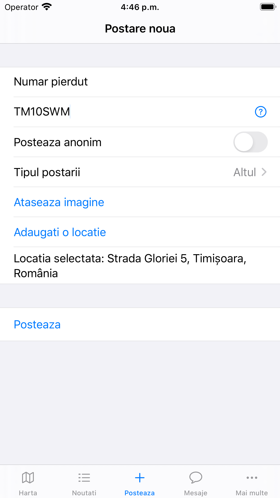

# Info Traffic

An application with and about traffic participants. Through the application you can inform the other participants about accidents, blockages, bumps or any traffic danger. Moreover, communicate with them through messages based on the registration number.

# How it works?

After downloading the application, you must register using an e-mail address and a registration number. Based on the registration number, your account will be identified and you will receive messages and notifications from other traffic participants.

## Map

Contains all posts about traffic incidents in the form of locations. By clicking on a location a pop-up opens and you can see all the details about that post.

## News

Contains all posts in detailed form. You can see the time of the incident, a description of it and its location. You can also add or view other users' comments for a specific post.

## Post

Have you seen an accident / incident in traffic? Tell the others.
Add a short description, the registration number of the car involved in the incident / accident (so that you can be informed immediately about what happened), an image and the location.

## Messages

Do you want to send a message to a traffic participant? Nothing easier. Look for his registration number in Messages, and if he uses the application, he can start the discussion.

### Contact

For any information, problems, new functionalities that you would like to be added you can contact me at claudiu_stefaniga@yahoo.ro or through the application at CS42SKY.
